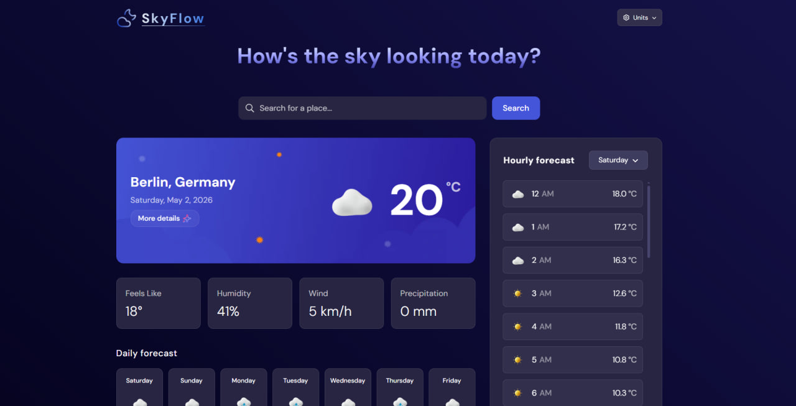

# SkyFlow - приложение прогноза погоды

Приложение для отслеживания погоды с современным стеком и фокусом на производительность.

## Стек:

- **Framework:** Next.js 15
- **Styling:** Tailwind CSS ^4, Recharts
- **Data Fetching:** TanStack Query (React Query) v5
- **State Management:** Zustand
- **API:** Open-Meteo (Geocoding and Forecast)
- **Testing:** Vitest, MSW (Mock Service Worker)
- **Code Quality:** TypeScript, Eslint, Commitlint, Husky

## Особенности:

- **Умный поиск:** поиск городов с обработкой ошибок
- **Сохранение данных:** хранение истории и избранных городов в localStorage
- **Детальный прогноз:** текущая погода, почасовой и недельный прогноз с графиком
- **Настройки:** возможность изменять единицы измерений
- **UX/UI:** адаптивный дизайн и использование пульсирующих skeleton-компонентов
- **Надёжность:** полная типизация и покрытие тестами (unit, integration)

## Структура:

- `src/app/` - роутинг и основная страница приложения
- `src/components/` - разделенные UI-компоненты
- `src/hooks/` - кастомные хуки для работы с логикой и с API
- `src/mocks/` - конфигурация MSW для тестирования перехвата сетевых запросов
- `src/services/` - функции запросов к API
- `src/stores/` - управление глобальным состоянием с zustand
- `src/types/` - глобальные TS интерфейсы
- `src/utils/` - вспомогательные функции

## Запуск:

1. установить зависимости: `npm i`
2. запустить сервер: `npm run d`
3. запуск тестов: `npm run test`

---

- проект - решение задания с заготовленным дизайном и добавления новых идей и деталей
- дизайн: https://www.frontendmentor.io/challenges/weather-app-K1FhddVm49
